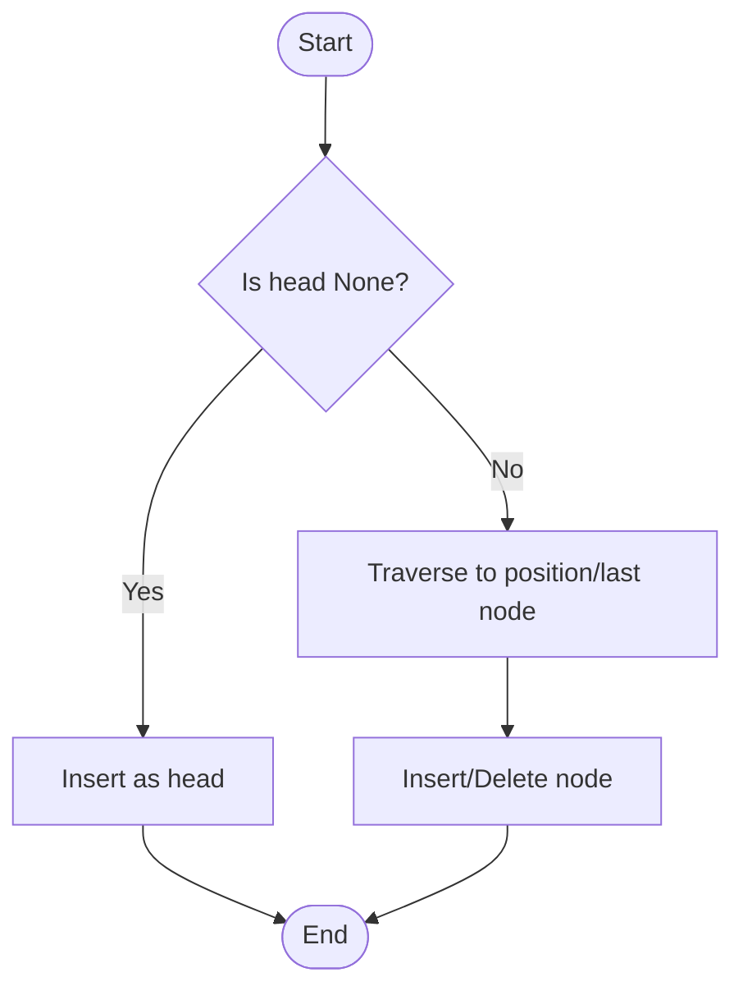

# LinkedList Implementation in Python

This file contains a basic implementation of a singly linked list in Python. It demonstrates how to create a linked list, insert elements at the beginning and end, and delete elements from the beginning and end of the list.

## What is a Linked List?
A **linked list** is a linear data structure where elements (nodes) are stored in non-contiguous memory locations. Each node contains data and a reference (pointer) to the next node in the sequence. Linked lists are dynamic, allowing efficient insertion and deletion of elements.

## Flow Diagram
Below is a simple flow diagram for inserting and deleting nodes in a singly linked list, represented in Mermaid format:



## Uses of Linked Lists
- Dynamic memory allocation
- Implementation of stacks and queues
- Undo functionality in editors
- Adjacency lists for graphs
- Efficient insertions/deletions compared to arrays
- Real-time applications where memory reallocation is costly
- Polynomial arithmetic and sparse matrix representations

## Features
- **Node class**: Represents a node in the linked list, holding data and a reference to the next node.
- **LinkedList class**: Provides methods to:
  - Insert an element at the beginning (`insert_element_at_beg`)
  - Insert an element at the end (`insert_element_at_last`)
  - Insert an element at a specific index (`insert_at_index`)
  - Delete the first element (`delete_element_from_beg`)
  - Delete the last element (`delete_element_from_last`)
  - Delete an element at a specific index (`delete_at_index`)
  - Reverse the linked list (`reverse`)
  - Search for an element (`search`)
  - Print all elements in the list (`print_element_of_node`)
  - Handles edge cases such as empty list operations

## Time and Space Complexity
| Operation                          | Time Complexity | Space Complexity |
|------------------------------------|----------------|-----------------|
| Insert at Beginning                | O(1)           | O(1)            |
| Insert at End                      | O(n)           | O(1)            |
| Insert at Index                    | O(n)           | O(1)            |
| Delete from Beginning              | O(1)           | O(1)            |
| Delete from End                    | O(n)           | O(1)            |
| Delete at Index                    | O(n)           | O(1)            |
| Reverse Linked List                | O(n)           | O(1)            |
| Search for Element                 | O(n)           | O(1)            |
| Print All Elements                 | O(n)           | O(1)            |

- **n** is the number of nodes in the linked list.
- Space complexity is O(1) for operations, but the list itself uses O(n) space for n nodes.

## Example Usage
```python
root = Node(53)
linked_list = LinkedList()
linked_list.head = root
linked_list.insert_element_at_last(51)
linked_list.delete_element_from_last()
linked_list.print_element_of_node()
```

## Input/Output Examples

### Example 1: Insert and Print
**Input:**
```python
linked_list = LinkedList()
linked_list.insert_element_at_beg(10)
linked_list.insert_element_at_last(20)
linked_list.print_element_of_node()
```
**Output:**
```
10
20
```

### Example 2: Delete from Empty List
**Input:**
```python
linked_list = LinkedList()
linked_list.delete_element_from_beg()
```
**Output:**
```
Node is empty
```

### Example 3: Delete Last Node
**Input:**
```python
linked_list = LinkedList()
linked_list.insert_element_at_beg(5)
linked_list.delete_element_from_last()
linked_list.print_element_of_node()
```
**Output:**
(prints nothing, as the list is empty)

## Edge Cases
- Deleting from an empty list (should print a message and not crash)
- Deleting the only node in the list (should set head to None)
- Inserting into an empty list (should set head to new node)
- Printing an empty list (should print "Linkedlist is empty")
- Multiple consecutive deletions (should not cause errors)

## Notes
- The implementation is for educational purposes and demonstrates basic linked list operations.
- The `print_element_of_node` method prints and removes all elements from the list, as it advances the `head` pointer.
- For persistent printing without deletion, consider implementing a separate traversal method.

## File Location
`DSA/LinkedList/LinkedList_Implementation.py`

## Additional Resources
- [GeeksforGeeks: Linked List Data Structure](https://www.geeksforgeeks.org/data-structures/linked-list/)
- [Wikipedia: Linked List](https://en.wikipedia.org/wiki/Linked_list)
