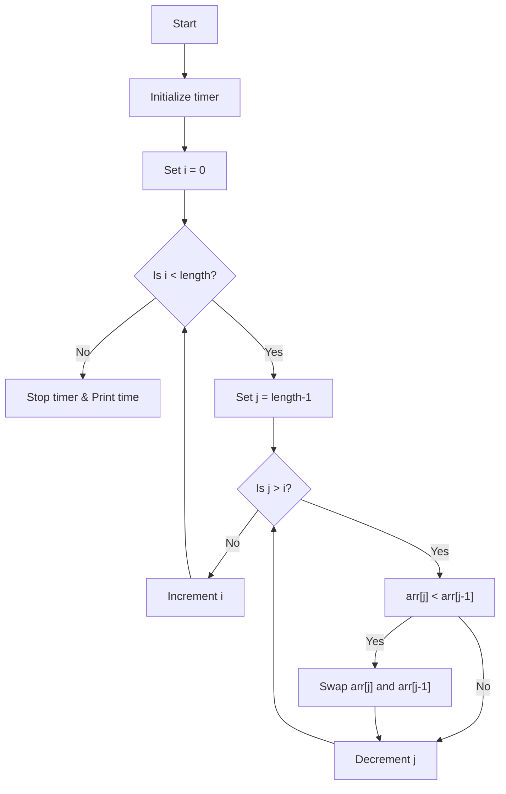

# Bubble Sort

## Algorithm

1. Start a timer to measure execution time.
2. For each element in the array (outer loop):
    - For each element from the end of the array down to the current position (inner loop):
        - If the current element is less than the previous element, swap them.
    - (Optimized version only) If no swaps occurred in the inner loop, break early as the array is sorted.
3. Stop the timer and print the elapsed time.
4. Return the sorted array.

The optimized version adds a check to stop early if the array becomes sorted before all passes are complete.

## Time and Space Complexity

| Algorithm                | Time Complexity (Best) | Time Complexity (Average) | Time Complexity (Worst) | Space Complexity |
|--------------------------|-----------------------|---------------------------|------------------------|-----------------|
| Bubble Sort (Normal)     | O(n^2)                | O(n^2)                    | O(n^2)                 | O(1)            |
| Bubble Sort (Optimized)  | O(n)                  | O(n^2)                    | O(n^2)                 | O(1)            |

## Flow Diagram

Below is a simple flow diagram for the Bubble Sort algorithm:

For the optimized version, add a check for swaps in each outer loop iteration and break if no swaps occurred.
